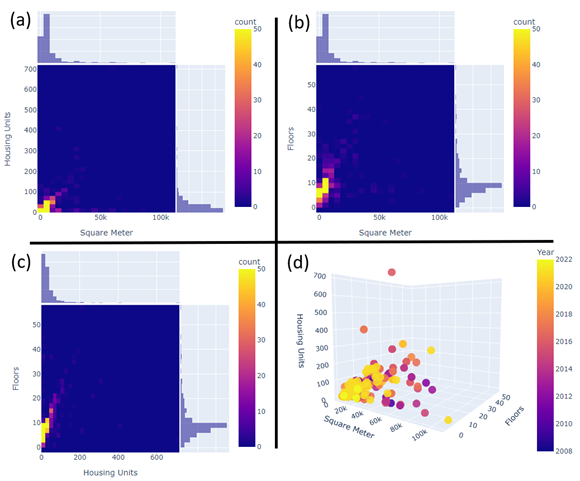
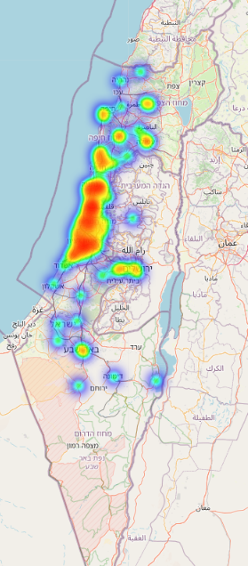
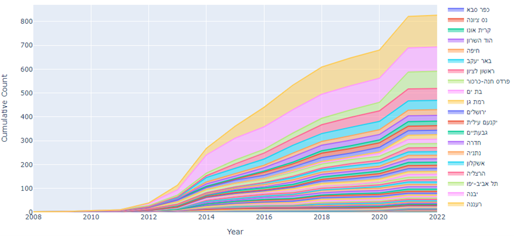

# Analysis-of-Sustainable-Building-in-Israel
This repository contains the final project created for the course "The Art of Analyzing Big Data - The Data Scientist Toolbox". The directive for this project was to gather, process, and analyze data on a chosen topic that is related to the housing market.   
[Notebook](Data_Science_Project.ipynb)  |  [Report](Analysis_of_Sustainable_Building_in_Israel.pdf)

  
  
  

## Introduction
This project presents an analysis of sustainable building data published by the Israeli Ministry of Environmental Protection. We focus on residential buildings and the differences throughout the years and between municipalities. Awareness of the need for green construction that preserves the values of sustainability and reduces energy consumption has been growing in recent years. Part of the purpose of the study is to examine how this is reflected in the construction industry.
All the code is included in the attached [notebook](Data_Science_Project.ipynb).

In this report we present the data used and the preprocessing steps implemented. This is followed by high-level explorations of the data using a variety of visualization tools including **choropleth heatmaps**, **density heatmaps**, **histograms**, **scatter plots** and more. An **analysis of the yearly changes** is presented, along with **linear regression models that try and derive trends over time**. The next chapter explores the **differences in sustainable building between local authorities**. Similar analysis of additional metrics (score, rank, type of construction projects) is included in the following chapter. Finally, a demonstration of **fitting multiple linear regression models that are based on demographic data to predict the volume of sustainable building**. This method is used to **derive interesting conclusion on the connection between demographic metrics of local authorities and sustainable building.**

  
    

